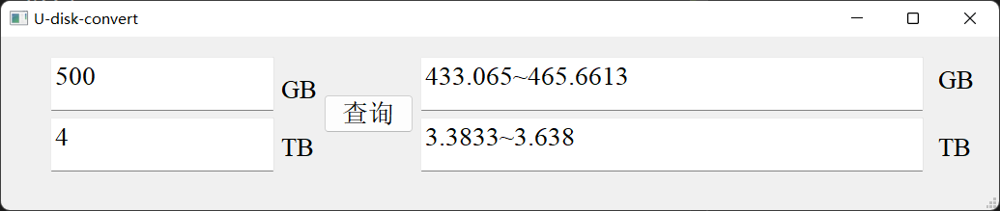

# U-disk-capacity-conversion
我们都知道，存储器的容量厂家和电脑的计算是不一致的，主要表现在电脑显示的容量小于你所购买的任容量，如果购买了U盘或硬盘，怎么知道容量是否正确，本项目帮你解决。

本项目依赖Pyqt5

win下：

`pip install PyQt5`

`pip install pyqt5-tools`

然后运行`U_disk.py`即可

样例：

